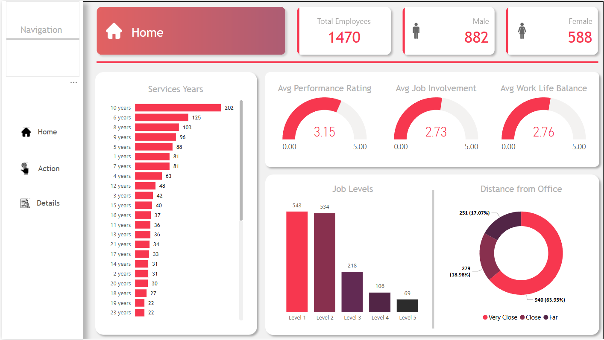
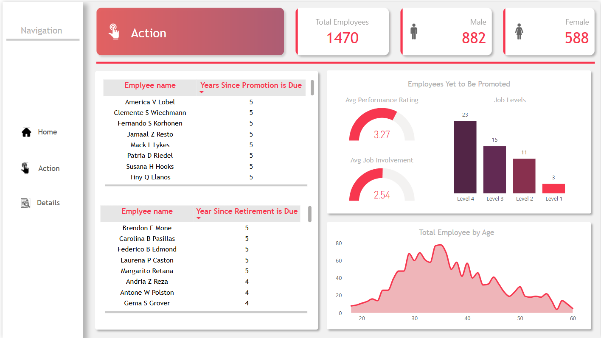
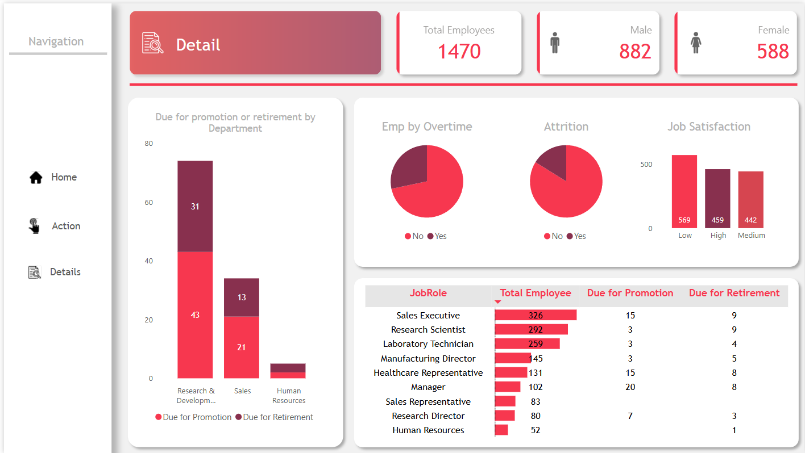

# HR Analytics Dashboard 📊

This Power BI project provides an interactive HR Analytics Dashboard that enables detailed insights into workforce demographics, performance, engagement, and succession planning.

## 🔍 Overview

The dashboard visualizes data for **1,470 employees**, with breakdowns by gender, job level, years of service, performance, retirement, and promotion timelines. It is structured into three interactive views:

- **Home View**: Key HR metrics and employee distribution
- **Action View**: Employees due for promotion or retirement
- **Details View**: Department- and role-level breakdowns with attrition and satisfaction insights

---

## 🏠 Home View

**Key Metrics:**

- Gender Distribution
- Avg Performance, Involvement, Work-Life Balance
- Years of Service
- Distance from Office
- Job Levels

---

## ⚙️ Action View

**Key Insights:**

- Employees due for promotion and retirement
- Avg Performance Rating and Job Involvement (for unpromoted employees)
- Total Employees by Age

---

## 🧾 Detail View

**Key Visuals:**

- Promotion/Retirement breakdown by Department and Job Role
- Overtime and Attrition insights
- Job Satisfaction levels

---

## ⚙️ Tools Used

- **Power BI**: Data modeling, DAX calculations, and dashboard design
- **DAX**: Custom measures and KPIs for insight generation

---

## 🎯 Purpose

This dashboard helps HR teams:

- Monitor workforce composition
- Identify employees nearing promotion or retirement
- Analyze job satisfaction and attrition patterns
- Take data-driven HR actions

---

👤 **Author**: Arnav Pandita
